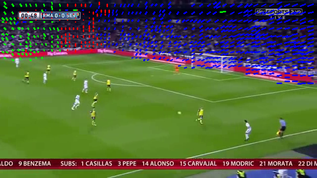

# SportCam_Operator_Actions_Monitoring

## About


SportCam_Operator_Actions_Monitoring (SCOAM) is a component for the analysis of sport camera operator’s movements such
as ZOOM IN / ZOOM OUT and LEFT-RIGHT ROTATION. It uses scene segmentation and vector analysis to find the direction of
camera movement.

We use the results of the analysis to tell if the moment is intense in the game. We get goal scenes by running
our [proprietary clustering framework](https://develop.aihunters.com/Sports-Highlights/#section/API-operations/Segmentation-service-API-operations).

## Output example


Watch the full video [here](https://player.vimeo.com/video/506058375).

## Run the analysis

To apply the component to video analysis, you need to follow these steps:

- Reduce video resolution to make processing faster (we used the 360x240 compression). You can do it by using this
command:
  
```commandline
ffmpeg -i input.avi -s 360x240 -c:a copy output.mkv
```


- Extract motion vectors from the received video by using the MV-Tractus
repository [here](https://github.com/jishnujayakumar/MV-Tractus). As the result you’ll get the JSONs for each frame
describing the motion vectors we need.
  
- Create virtual environment and install all the necessary libraries:

```commandline
python3 -m virtualenv SportCam_Operator_Actions_Monitoring_venv

```

```commandline
source SportCam_Operator_Actions_Monitoring_venv/bin/activate
```

```commandline
pip3 install requirements.txt
```

We ran the algorithm on the scenes containing football goal as we were interested in the types of movement happening
there in particular.

We got those scenes by using
our [proprietary clustering framework](https://develop.aihunters.com/Sports-Highlights/#section/API-operations/Segmentation-service-API-operations)
.  
- Next to start processing and get the final video, run the following:
    - python3 inference.py 
    
    - video_path - path to the video
       
    - path_to_motion_vectors - path to the folder containing motion
vectors for every frame

    - path_to_scenes_json [optional] - path to the meta containing scenes 
       
    - save_dir [optional] -
path to the directory where the results will be saved. If you leave it unspecified, it will be automatically created in
the project folder. 

    - save_images [optional] - if set True, all the intermediate steps will be visualized and saved. 
      
- If
you want to run the algorithm on the whole video without specializing scenes, leave this argument blank.

The script gets a JSON with the type of movement, visualizes it, generates images and then creates and saves a video.

## Algorithm description

- The examples of vectors output (red, blue, green lines and dots):




Here you can see the original vectors colored depending on the direction (red ones = null, blue = tilted right, green =
tilted left).

If you want to pick certain scenes with video filtration — it is set in **analysis.config.yml** by **“scenes_filtration”**.

- Frame segmentation. Since we want to rely only on vectors lying on representative stationary objects — the field and the
players do not fit, only the tribunes remain.

- We get a mask like this for each frame (the segmentation can also be regulate in **segmentation/config.yml**):


- Choose the vectors belonging to the tribunes only.

- Apply clusterization in each group using DBSCAN. With its help also delete anomaly vectors. Next, we analyze the
relative position of the obtained clusters and draw a conclusion about the type of movement. The clusterization
parameters are set in **clusterization/config.yml**.

Here’s the example of how clustering has filtered out the vectors lying on a logo (white dots on the logo):


- Post-processing combining sub-sets into sets can be applied optionally. It will make the visualization of the
analysis smoother. It can be turned on in **analysis/config.yml**.

## Important notice

- Please NOTE that this approach is sensitive to broken files (e.g. with the frames duplicated after repeated encoding).
- Check the types of the vectors you get when working with different types of codecs and video structure (FPS, compression
and so on). Our tests were run on cv2.VideoWriter_fourcc(*'DIVX')* with 25 FPS.

If your code isn’t working you should pay the most attention to the points above.

## License

SportCam_Operator_Actions_Monitoring is licensed under the GNU General Public License, either version 3 of the License,
or (at your option) any later version. All the third-party open-source software used in this project is listed in
Third-Party Software Notice together with the according licenses.
https://github.com/AIHunters/SportCam_Operator_Actions_Monitoring

## Send us your feedback!

We're open to any kind of communication, whether it is your feedback, failure cases, questions, possible improvements or
cooperation possibilities. Contact us at oss@aihunters.com. Please adhere to our CODE_OF_CONDUCT to keep a positive and
constructive environment here.

